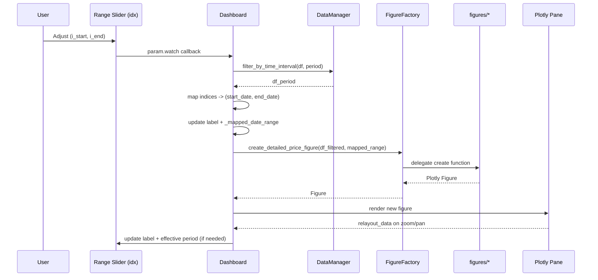

# Architecture Overview

## High-Level
- UI Framework: Panel (Rows/Columns, panes, widgets)
- Charts: Plotly (Graph Objects, subplots)
- Data: Pandas dataframes via `DataManager`
- Config: `AppConfig` for styles, time intervals, colors
- Modular Dashboards: `web/dashboards/*`
- Shared Components: `web/components/*`
- App Entrypoint: `web/app/main.py` and `web/app/launch.py`

## Folder Structure
```
web/
  app/
    main.py            # Mount dashboards and template
    launch.py          # Local dev runner (app.show)
    base_dashboard.py  # Common behaviors & footer
    figure_factory.py  # Centralized Plotly figure creation
    config.py          # App-wide configuration
    data_manager.py    # Data fetching, filtering, stats, indicators
  dashboards/
    simple_price_dashboard.py
    detailed_price_chart.py
    market_overview.py
  components/
    widgets.py         # Selectors, range slider + label
    ui.py              # Header, summary box
    explanations.py    # Reusable markdown panes
    layouts.py         # Legend config + margins helpers
```

## Runtime Flow
1. User opens app via `launch.py` (Panel) or `panel serve main.py`.
2. `main.py` registers dashboards and builds the UI template.
3. Each dashboard:
   - Creates widgets via `components/widgets.py`.
   - Fetches/filters data via `DataManager`.
   - Builds charts via `FigureFactory` (delegates to `web/figures/*`).
   - Renders layout (header, summary, controls, chart, info, footer).

## Key Design Decisions
- Shared components for consistency and maintainability.
- Index-based date slider for deterministic range control.
- FigureFactory centralizes Plotly construction and styling and delegates to modular figure files.
- Layout helpers to standardize margins and legend presentation.

> See also: `docs/developer-notes.md` for quick-start commands and diagram export steps.

### Class Diagram

The main classes and their relationships are captured in:

- `docs/diagrams/classes.mmd` (Mermaid source)
- `docs/diagrams/classes.png` (rendered image)

## Interaction Diagram

```mermaid
flowchart LR
    U[User] -->|Clicks/Zooms| W[Widgets / Plotly Pane]
    W -->|param.watch| DMW[Dashboard Handlers]
    DMW -->|symbol change| DM[DataManager]
    DMW -->|period/range change| DM
    DM -->|fetch_combined_data| DF[(DataFrame: OHLCV)]
    DM -->|filter_by_time_interval / indicators / stats| DF2[(Filtered/Enriched DF)]
    DMW -->|_update_display| FF[FigureFactory]
    FF -->|create_*| FG[web/figures/*]
    FG --> PL[Plotly Figure]
    PL --> PPane[Panel Plotly Pane]
    PPane -->|relayout_data (zoom/pan)| DMW
    DMW -->|update mapped dates/period| W
```

## Sequence: Update on User Range Change



## Resampling & Volume Aggregation

- Resample cadence is chosen by visible date span or selected period:
  - Up to ~3 months → Daily (`D`)
  - Up to 2 years → Weekly (`W`)
  - Longer → Monthly (`M`)
- Volume subplot aggregates by resample period and autoscale Y-axis to visible window.

## Modules Involved

- App Core: `web/app/main.py`, `launch.py`, `dashboard_registry.py`, `base_dashboard.py`
- Configuration: `web/app/config.py` (colors, styles, intervals, Plotly template)
- Data: `web/app/data_manager.py` (fetch, filter, indicators, stats)
- Figures:
  - Factory: `web/app/figure_factory.py` (delegates and standardizes)
  - Implementations: `web/figures/*.py` (simple, candlestick, volume, detailed)
- Components: `web/components/*` (widgets, layouts, ui, explanations)
- Dashboards: `web/dashboards/*` (page orchestration and wiring)
